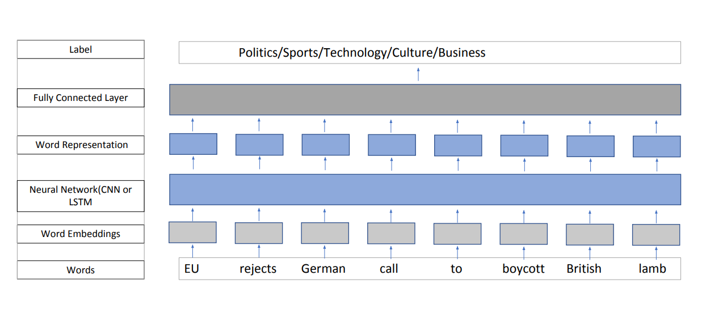

# Crawling Literature and classifying them with Natural Language Processing

This project includes crawling the web for new articles and applying Natural Language processing techniques to analyze and predict the categories of news

## Getting Started

### General Usage
```bash
usage: fetch_data.py [-h] -f FROM_DATE -t TO_DATE [-c CATEGORY] -p PATH_TO_DIR

optional arguments:
  -h, --help            show this help message and exit
  -f FROM_DATE, --from_date FROM_DATE
                        From date
  -t TO_DATE, --to_date TO_DATE
                        To date
  -c CATEGORY, --category CATEGORY
                        Category to fetch, if not mentioned all categories
                        will be fetched
  -p PATH_TO_DIR, --path_to_dir PATH_TO_DIR
                        Path to directory to save the files
```

## Training the model
To train the model use the following command.

To train a model set using any of the configuration file and run the following command.
```bash
usage: python main.py -c configs/<any config file>

example:
python main.py -c configs/BiLSTM_model_title.json
```

## Methodology


## Model Architecture

